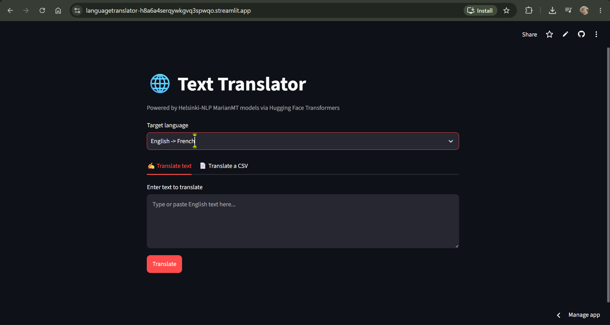
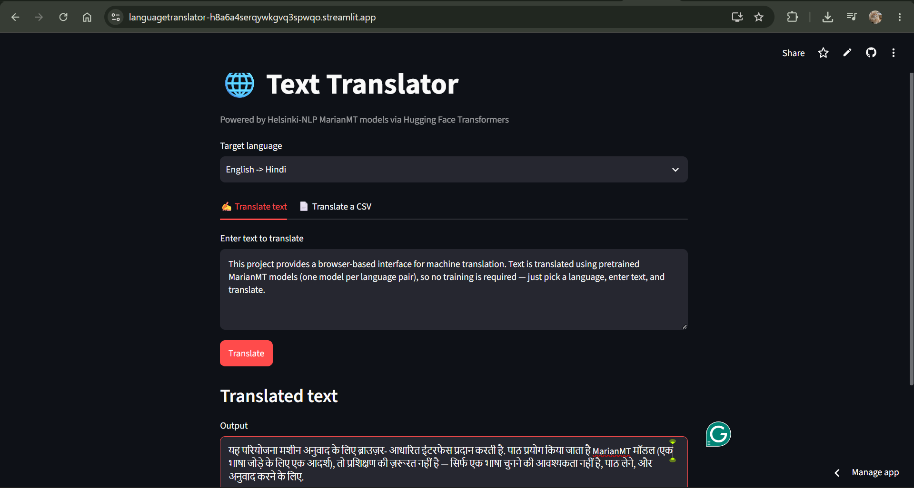

# 🌐 Text Translator

A simple web app for translating text between English and 11 other languages, powered by [Helsinki-NLP MarianMT](https://huggingface.co/Helsinki-NLP) models via Hugging Face Transformers. Supports both single-text translation and batch translation of CSV files.


**[Live Demo](https://languagetranslator-h8a6a4serqywkgvq3spwqo.streamlit.app/)** &nbsp;•&nbsp; [Features](#features) &nbsp;•&nbsp; [Setup](#setup) &nbsp;•&nbsp; [Usage](#usage)

---

## Overview

This project provides a browser-based interface for machine translation. Text is translated using pretrained MarianMT models (one model per language pair), so no training is required — just pick a language, enter text, and translate.

## Features

- ✍️ **Text mode** — type or paste text and get an instant translation
- 📄 **Batch mode** — upload a CSV with a `reviewText` column and translate every row, then download the results as `translated_reviews.csv`
- 🌍 **11 language pairs** — French, German, Spanish, Chinese, Japanese, Italian, Russian, Portuguese, Dutch, Hindi, and Arabic (all from English)
- ⚡ **Cached models** — each language model loads once per session, not on every request

## Screenshot


> 
> 
 

## Setup

Clone the repo and install dependencies:

```bash
git clone https://github.com/<your-username>/<repo-name>.git
cd <repo-name>
pip install -r requirements.txt
```

### requirements.txt

```
streamlit
pandas
transformers
torch
sentencepiece
sacremoses
```

## Usage

Run the app locally:

```bash
streamlit run translation_app.py
```

Then open the URL Streamlit prints (usually `http://localhost:8501`) in your browser.

**Text translation:** select a target language, enter text in the box, and click **Translate**.

**Batch translation:** switch to the "Translate a CSV" tab, upload a CSV containing a `reviewText` column, click **Translate CSV**, and download the results.

## Deploying

This app deploys for free on [Streamlit Community Cloud](https://streamlit.io/cloud):

1. Push this repo to GitHub (include `translation_app.py` and `requirements.txt`)
2. Go to [share.streamlit.io](https://share.streamlit.io), sign in with GitHub, and select this repo
3. Set the main file path to `translation_app.py` and deploy
4. Replace the `#` in the **Live Demo** link above with your deployed URL

## Project Structure

```
.
├── translation_app.py      # Streamlit interface
├── requirements.txt        # Python dependencies
├── README.md               # This file
└── assets                  # Contain screenshots
```

## Tech Stack

- [Streamlit](https://streamlit.io/) — web interface
- [Hugging Face Transformers](https://huggingface.co/docs/transformers) — MarianMT models and tokenizers
- [Pandas](https://pandas.pydata.org/) — CSV handling

## License

This project is licensed under the MIT License.
